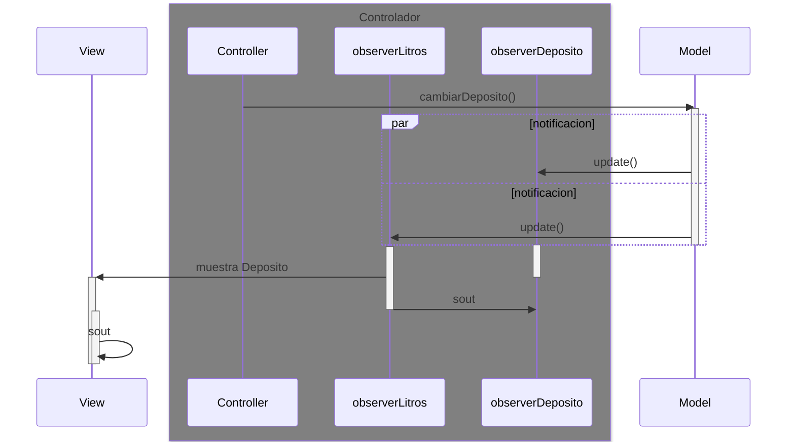

```mermaid
sequenceDiagram
    participant View
    box gray Controlador
    participant Controller
    participant observerLitros
    participant observerDeposito
    end
    participant Model

    Controller->>Model: cambiarDeposito()
    activate Model
    par notificacion
        Model->>observerDeposito: update()
    and notificacion
        Model->>observerLitros: update()
        end
    deactivate Model
    activate observerDeposito
    activate observerLitros
    observerLitros->>+View: muestra Deposito
    deactivate observerDeposito
    observerLitros->>-observerDeposito: sout
    activate View
    View->>-View: sout
    deactivate View
```