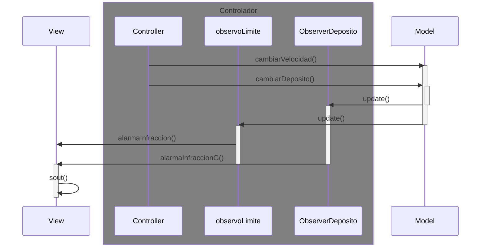

# Arquitectura MVC con Observer

## Diagrama de Secuencia

Que ocurre cuando se cambia la velocidad

Observador (que vigile el limite de velocidad), entonces se lanza el `update()` 

---
## Pasos para la configuración

1. Crear una clase ObserverDeposito
    * definir el método `update()` - ¿Qué hace este observador, que necesita?
2. Implementar el método `notifyObservers()` en el modelo
    * llama a los `update` de los observadores
3. En el modelo, en cada c método que hay cambios:
    * llamar a `notifyObserversG()`
4.Cree una nueva variable en coche que llame deposito inicialice a 0 y mas tarde estableci un limite

